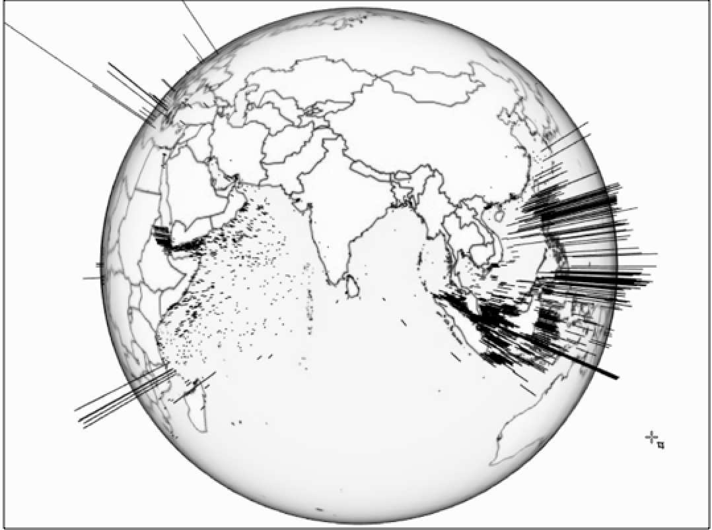
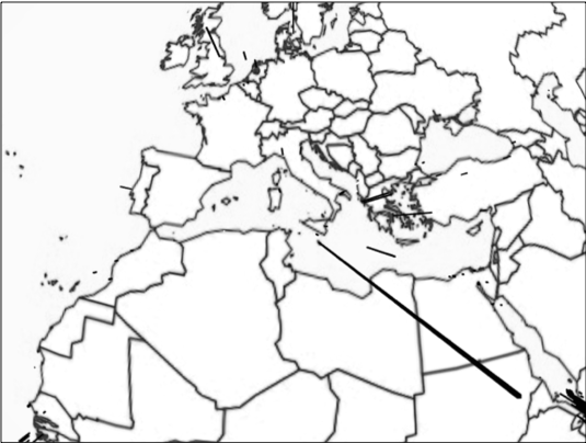
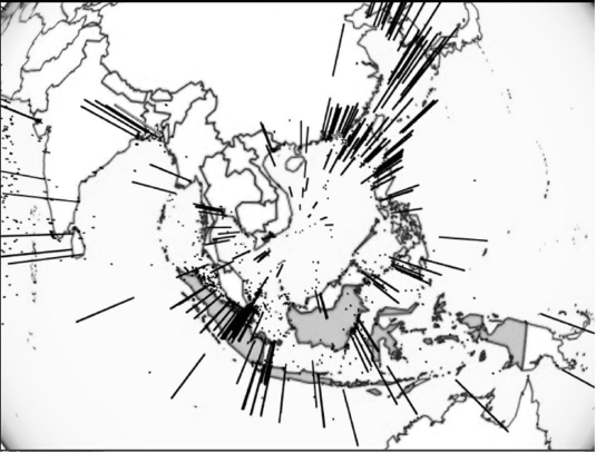
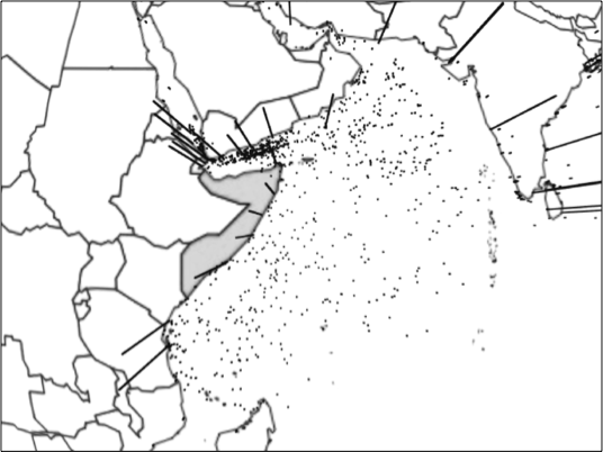
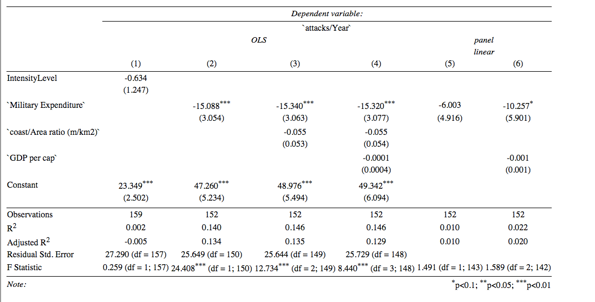

```{r, echo=FALSE, include=FALSE}
library(base)
library(rio) # swiss army knife for imports
library(plyr) # count occurences
library(dplyr) # data wrangling
library(tidyr) # data wrangling
library(ggplot2) # nice plots
library(stargazer) # nicer regression output which looks like a real publication
library(car) # scatterplots 
library(httr) # scraping from http sites
library(XML) # Tool for generating XML file
library(WDI) # Scraping Data from the World Bank 
library(countrycode) # provides world bank country codes 
library(gplots)
library(plm)
library(knitr)
library(repmis)
library(Amelia)

pkgs <- c("base", "rio", "plyr", "dplyr", "tidyr", "ggplot2", "stargazer", "car", "httr", "XML", "WDI", "countrycode", "gplots", "plm", "knitr", "repmis", "Amelia", "reshape")
repmis::LoadandCite(pkgs, file = "Rpackages.bib", install = FALSE)

```

# Introduction

With a fleet of around 3,500 of the world’s largest merchant vessels, Germany has a strong motivation to ensure the security of global sea routes. According to the Berlin-based think-tank Stiftung Wissenschaft und Politik (SWP), with an average of EUR 47.4 million lost to trading disruption annually and 1,400 service-men and women actively engaged in counter-piracy measures, it is a central policy area for Germany's growing prominence in international affairs. 

With this in mind, it is important to consider the impact of German maritime piracy policy in areas where there has been a high degree of special attention and deployments. The Horn of Africa is one such area, where ATALANTA (the European Union's naval mission to this area) currently provides for patrols along the coast of Somalia to defend trading vessels from maritime piracy attacks. Though media attention and appetite for piracy stories appears to be fading, this does not presuppose a reduced danger of maritime piracy, as will be seen in this report. 

In contrast to consideration of German maritime policy concerns, this paper also attempts to consider the pirates' perspectives. Interestingly not all piracy attacks are successful, and the ratio varies from country to country and over time. Through gaining an understanding of what drives piracy attacks, why and when they are successful, and how much individual attacks can impact on trade we can develop a clearer model for future preventative measures. This is especially necessary since the cost intensity of deployment for international naval forces in Somalia shows how serious countries take the threat whose trade is affected, but also just how much is at stake. 

## A Definition for 'Piracy' 

To commence our understanding for piracy under the United Nations Convention on the Law of the Sea, we define a piracy attack for the purpose of our study under Article 101:

Article 101 Definition of piracy Piracy consists of any of the following acts: 
(a) any illegal acts of violence or detention, or any act of depredation, committed for private ends by the crew or the passengers of a private ship or a private aircraft, and directed: (i) on the high seas, against another ship or aircraft, or against persons or property on board such ship or aircraft; (ii) against a ship, aircraft, persons or property in a place outside the jurisdiction of any State; 
(b) any act of voluntary participation in the operation of a ship or of an aircraft with knowledge of facts making it a pirate ship or aircraft; 
(c) any act of inciting or of intentionally facilitating an act described in subparagraph (a) or (b). 

## Our Data: Global, Macro- and Micro-Levels

Since 1992, the International Maritime Bureau (IMB), a daughter organisation of the International Chamber of Commerce, has reported piracy attack globally. Since then it has published an annual overview of all attacks that happened in a year that includes comprehensive details for incidents. 

The dataset for this project was presented to us in a "ready to use" format by a research cluster at the University of Tennessee. Principally, our data includes information for all global piracy attacks from 1994 to 2014 that were scraped with web analysis tools from multiple reports.  A research team around Professor Christian Traxler from the Hertie School of Governance parsed the data out of the annual reports in PDF format, and merged them into one dataset about piracy attacks from 1993 to 2011 (counts 5619 attacks). As a courtesy from Professor Ursula Daxecker from the University of Amsterdam we received a ready-to-use dataset which, as a subset of the original data, contains slightly differently coded and fewer variables for the analysis from 1993 to 2014 (counts 6,343 attacks). Using these annual reports provided by the IMB we could also refine our analysis of distinct types of piracy attacks by, for instance, generating new variables that calculate average pirate success ratios over time, by dividing total attacks by the number of attacks that were reported successful.

The unit of analysis in all datasets is the single attack, or in other words one row equals one attack. As our analysis builds up on the dataset from Professor Daxecker, in the following we will refer to her version of the dataset solely. The dataset comes already slightly reduced. It contains 25 variables, and counts 6,343 attacks between 1993 and 2014. We kept the wide format of the dataset, but reduced it to the variables of interest. In more concrete terms, you will find a binary coded dependent variable for the incident type, or whether an attack was successful or not. The explanatory variables are the ship type, adjusted depending on the model, the ship's status, or if it is moving or not and a time of day variable splitting one day into 4 time categories. Still, the necessary variables needed some wrangling. We cleaned them from missing and nonsensical values, renamed the variable and value labels, and grouped some categories of the key categorical variables.

## Additional Data Gathering: Wikipedia & World Bank datasets

The original dataset contains the attacks that were reported by the victims of piracy. As an additional variable, relevant to our field of piracy investigation and patrols, we were intrigued by the relative effect that a longer coast length of a country has on the level of attacks that country suffers. To address this question we parsed a table titled "List of countries by length of coastline" from a Wikipedia page that had, in turn, used information from the CIA World Factbook. We then merged this coastline data with our existing dataframe using the 'right outer join' method.

Of critical interest to us were the respective 'Coast/Area' ratios (measured in km of coast length to km of square land) that serves as an insightful control for our country dependent variable.

The information about the gross domestic product comes from the Worldbank and was scraped with the WDI package for R. The scraped data comes in a country-year format, thus it comes already in a format we need to conduct our analysis.

# Research Design

## Note on Structure

This paper seeks to conduct research and propose several testable hypotheses that can be modeled to explain key trends, insights and patterns in global piracy levels, and identify circumstances in which attacks are successful.

Pursuant to this, our paper is structured around three key focuses:
1. **Global and Regional Overview: Coastal Length & Vessel Status Determinants** with the use of a global mapping tool, and with consideration of key piracy hotspots. 
2. **Macro-level: Country-Piracy Rankings and the Effect of Military Expenditure** With the burgeoning budget of the ATALANTA member-state contributors, we attempt to investigate whether this increased spending is in fact translating into affirmative results. 
3. **Micro-level: Success Ratio Determinants for Piracy Attacks** Considering attacks from a pirate's perspective, we consider what some of the key explanatory variables are that determine a successfully executed attack. For instance, does the number of attacks decrease the likelihood of attacks being successful?

## Dependent Variable & Three Research Questions 

Our dependent variable in this study is the success rate for pirate attacks, calculated by the number of successful attacks divided by the total number of attacks. We expect that mainly the total number of attacks has an impact on this ratio. The fact that the dependent variable actually consists of our key independent variable makes it fraught. However, we think that there must be a visible learning effect, either from law enforcement bodies, the shipping crew, or the pirates. So far this was the only feasible way we could observe this effect.

Furthermore, additional exogenous variables have been included that in theory should have an impact on the inspected success rate. GDP (per capita per year) as a mirror for the economic incentives to conduct piracy is expected to influence the success rate over time. Likewise, a country's ratio of coast line to its land area should be a good whether piracy attacks happen more often.

For our three different sections, our three research questions are therefore:
1. Does the number of attacks increase the higher the coast-land ratio?
2. Does the success rate peek and eventually decrease after a certain amount of piracy attacks?
3. Will success rates for pirate attacks decrease as the GDP increases, given that there is less incentive to conduct an attack and only less skilled pirates will make attempts?

# Global and Regional Overview: Coastal Length & Vessel Status Determinants

Our global overview model provides insight on the issue of piracy 'on the high seas' by investigating whether a country's coastal length has an effect on the number and location of pirate attacks we can observe. The assumption here is that if a country has a higher coastal to country ratio (an island-state, such as Malta in figure 2, for instance) then it should be less likely that that country is affected by maritime piracy, since there is a greater incentive to defend itself and maritime defence is therefore prioritised and greater in that country.

* H1: Most pirate attacks occur in areas where countries have smaller country-to-coast ratios, and thus are less incentivised to defend against maritime pirate attacks. 
* H0: Whether a country has a greater country-to-coast ratio has either an inverse or no effect on where pirate attacks occur.

To observe this we have coded the arc length (shown in black) of the individual attacks that occur to show height of coastline-to-country ratios. If there is a tall arc, then the country has a proportionately higher coastal size. The expectation is therefore that fewer tall arcs should appear since these countries are actively patrolling and bordering their vulnerable coastlines.

 


Nb. Arc length indicates high coast length to country mass

This is not always the case, depending on region. Our H1 remains true for the area around the Gulf of Aden and particularly in the Arabian Sea, where countries with less incentive to defend maritime areas do indeed suffer from higher attack frequency. Oman, Pakistan, India, Somalia, Kenya and Tanzania are prime examples of this pattern.

However, the results change when shifting focus to the South China Sea. Despite Indonesia and the Philippines (highlighted in figure 1) having very long coastal lengths, a lot of attacks can be observed. This confirms our H0 null hypothesis, with contrary results occuring for Southeast Asian States.

 

<div>
 

* H1: Stationary ships are more likely to be attacked than moving ships in Southeast Asia. 
* H0: Stationary ships are no less, or less likely, to be attacked than moving ships in Southeast Asia.

In this globe we take a regional focus for Southeast Asia. We can observe that whether a ship was moving (dot) or stationary (arc) appears to make little difference to the number of relative pirate attacks. This could be potentially due to the archipelago maritime geography; with many ports concentrated in a small area pirates may have similar accessibility to pirating trade both for anchored ships as well as for ships underway.
</div>


 

Nb. Arc length indicates vessel status (moving to stationary)

* H1: Stationary ships are more likely to be attacked than moving ships in the Arabian Sea. 
* H0: Stationary ships are no less, or less likely, to be attacked than moving ships in the Arabian Sea.

In this globe we take a regional focus for the Arabian Sea that includes the Gulf of Aden. We can observe that whether a ship was moving (dot) or stationary (arc) appears to make a large difference to the number of relative pirate attacks. Ships that were underway were more likely to be attacked. This is likely due to how large oceangoing ship traffic often transits through the Arabian Sea, but does not anchor. Pirates are therefore forced to conduct mobile pirate raids.

# Macro Level: The Effects of Military Expenditure and Armed Conflict on Piracy

In order to approach the question for what drives piracy, we decided to take a multi-pronged approach.  While the analysis that preceded this segment of the report focused on incident level data and visualizing it in a novel way for analytical purposes, this portion of our research focuses on aggregated yearly data for the eight countries that were the closest coastal state to the most frequent occurrences of piracy.  These countries are predominantly in South East Asia, but there are a few exemptions.  The countries are: Bangladesh, Brazil, India, Indonesia, Malaysia, Nigeria, the Philippines, and Vietnam.  

While it is important to note that we could be skewing our data by both selecting for countries that are home to the most frequent occurrences of piracy as well as by aggregating our data to the year level.  However, by doing we also enable several advantages.  By aggregating the data, we are able to explore the information in a different way than either of the other two sections in this research paper.   Both of the other threads of research deal with incident level data which is useful, but here we can explore questions such as: What drives the number of attacks per year? Does military expenditure play a role? Are there any identifiable trends among the most heavily pirated countries? 

We begin our aggregated data level analysis with a simple histogram showing the frequency of attacks sorted by the attacks per year in bins of 20. It quickly becomes evident that the vast majority of years had 1-20 reported attacks. The frequency then declines sharply within the 20-40 range and then again in the 40-60 range. We see a slight surge in number of attacks per year within the 80-100 range; this is due to highly pirated coastal areas such as Bangladesh and the Philippines.

```{r, echo=FALSE, message=FALSE}
#import data
# empty cells are now coded with NA and can manually be excluded from any function with na.omit command
shipping <- read.csv("shippingraw.csv", header = TRUE, sep = ",", stringsAsFactors = FALSE, na.strings = c("", "NA"))

#renaming and dropping some of our columns 
names(shipping)[1] <- 'country'
names(shipping)[2] <- 'year'
shipping$X1 = NULL
names(shipping)[3] <- 'coast/Area ratio (m/km2)'
names(shipping)[4] <- 'GDP per cap'
names(shipping)[5] <- 'attacks/Year'
names(shipping)[6] <- 'successful Attacks/Year'
names(shipping)[7] <- 'success Ratio'
```
```{r, echo=FALSE, fig.cap="Frequency of Attacks per Year in Bins"}
hist(shipping$`attacks/Year`, main='Frequency of Attacks per Year in Bins', xlab='Number of Attacks per Year', ylab='Frequency')
```


When we examine the heterogeneity of attack success across countries it appears that a pirate's chance of a successful attack is highly dependent on the closest coastal state. For instance, the chances of a successful attack in the Philippines is lower than the odds of a successful attack in Bangladesh or Brazil. This also holds true when considering confidence intervals which are also depicted.
```{r, echo=FALSE, fig.cap="Average Success Ratio of Pirates per Country"}
plotmeans(shipping$`success Ratio` ~ country, main="Average Success Ratio of Pirates per Country", data=shipping, xlab="Country", ylab="Success Ratio")
```
The variable success rate was created by taking the number of successful attacks and dividing it by the number of attempted attacks. Thus, we can conclude that every pirate attack in India has a mean chance of 80% of success, with fairly large 95% confidence intervals stretching out from 85% to 75%, approximately. 


When we examine the heterogeneity across years the means seem to stay within the .65 - .85 range. Thus, we can conclude that the average chance of a pirate attack succeeding is between 65% and 85%.  This of course depends on many variables such as year, country, and as well explore later, the military expenditure of those countries.  Due to extremely large confidence intervals, time does not appear to be statistically significant.

```{r, echo=FALSE, fig.cap="Average Success Ratio of Pirates per Year"}
plotmeans(shipping$`success Ratio` ~ year, main="Average Success Ratio of Pirates per Year", data=shipping, xlab="Year", ylab="Success Ratio")
```

Through various models, it became evident that this portion of our research, which was based off of aggregated yearly data, was much more apt at explaining the number of attacks per year instead of the success ratio of attacks.  This can be easily understood by a brief glance at our list of variables.  On the incident level we have indicators such as vessel type and vessel status, e.g., what kind of ship is it and what is it doing - moving or sitting still.  These factors play a much more significant role in predicting whether or not pirates will be successful. However, this current portion of the research allows us to include factors that our other models cannot such as GDP per capita in the closest coastal country, military expenditures, etc.   All of these factors are more strongly related to attack frequency, as we will show.

Military expenditure proved to be a much stronger explanatory variable for predicting attacks per year than another variable which we attempted to add to our model, 'Intensity Level' which measures armed conflict in the area. 

```{r, echo=FALSE, message=FALSE}
#import data
# empty cells are now coded with NA and can manually be excluded from any function with na.omit command
ucdp.prio <- read.csv("124920_1ucdpprio-armed-conflict-dataset_v.4-2015.csv", header = TRUE, sep = ",", stringsAsFactors = FALSE, na.strings = c("", "NA"))
# have a look at how the variables are created

names(ucdp.prio)[3] <- 'country'
names(ucdp.prio)[2] <- 'year'

ucdp.prio$ConflictId <- NULL
ucdp.prio$SideA <- NULL
ucdp.prio$SideA2nd <- NULL
ucdp.prio$SideB <- NULL
ucdp.prio$SideBID <- NULL
ucdp.prio$SideB2nd <- NULL
ucdp.prio$Incompatibility <- NULL
ucdp.prio$TerritoryName <- NULL
ucdp.prio$CumulativeIntensity <- NULL
ucdp.prio$TypeOfConflict <- NULL
ucdp.prio$StartDate <- NULL
ucdp.prio$StartPrec <- NULL
ucdp.prio$StartDate2 <- NULL
ucdp.prio$StartPrec2 <- NULL
ucdp.prio$EpEnd <- NULL
ucdp.prio$EpEndDate <- NULL
ucdp.prio$EpEndPrec <- NULL
ucdp.prio$GWNoA <- NULL
ucdp.prio$GWNoA2nd <- NULL
ucdp.prio$GWNoB <- NULL
ucdp.prio$GWNoB2nd <- NULL
ucdp.prio$GWNoLoc <- NULL
ucdp.prio$Region <- NULL
ucdp.prio$Version <- NULL

ucdp.prio <- ddply(ucdp.prio, .(country, year), numcolwise(sum))

ship.ucdp <- merge(shipping, ucdp.prio, by=c("country","year"), all.x=TRUE) 
remove(list=c("shipping"))
remove(list=c("ucdp.prio"))

ship.ucdp <- unique(ship.ucdp[ , 1:8 ] )

ship.ucdp$IntensityLevel[is.na(ship.ucdp$IntensityLevel)] <- 0 

#######################
#adding military expenditure numbers
######################
#import data
# empty cells are now coded with NA and can manually be excluded from any function with na.omit command
Military <- read.csv("Military.csv", header = TRUE, sep = ",", stringsAsFactors = FALSE, na.strings = c("", "NA"))
# have a look at how the variables are created

names(Military)[1] <- 'country'
names(Military)[2] <- '1992'
names(Military)[3] <- '1993'
names(Military)[4] <- '1994'
names(Military)[5] <- '1995'
names(Military)[6] <- '1996'
names(Military)[7] <- '1997'
names(Military)[8] <- '1998'
names(Military)[9] <- '1999'
names(Military)[10] <- '2000'
names(Military)[11] <- '2001'
names(Military)[12] <- '2002'
names(Military)[13] <- '2003'
names(Military)[14] <- '2004'
names(Military)[15] <- '2005'
names(Military)[16] <- '2006'
names(Military)[17] <- '2007'
names(Military)[18] <- '2008'
names(Military)[19] <- '2009'
names(Military)[20] <- '2010'
names(Military)[21] <- '2011'
names(Military)[22] <- '2012'
names(Military)[23] <- '2013'
names(Military)[24] <- '2014'


library(reshape)
x2 <- melt(Military,id=c("country"),variable_name="Year")
x2[,"Year"] <- as.numeric(gsub("X","",x2[,"Year"]))

names(x2)[2] <- 'year'
names(x2)[3] <- 'Military Expenditure'

ship.ucdp.mil <- merge(ship.ucdp, x2, by=c("country","year"), all.x=TRUE) 
remove(list=c("Military"))
remove(list=c("x2"))
remove(list=c("ship.ucdp"))
```
```{r, echo=FALSE, fig.cap="Visualizing the Affect of Military Expenditure on Piracy Rates"}
plot(ship.ucdp.mil$`Military Expenditure`, ship.ucdp.mil$`attacks/Year`, main='Visualizing the affect of Military Expenditure on Piracy Rates', xlab='Military Expenditures', ylab='Number of Attacks per Year')
```


Unfortunately, including both an indicator for armed conflict in the closest coastal state as well as an indicator for military expenditure in the closest coastal states would prove to yield biased results due to multicollinarity.  As we can visually see, both potential indicators are correlated with each other.

```{r, echo=FALSE, fig.cap="Visualizing the Correlation Between Armed Conflict and Military Expenditures"}
plot(ship.ucdp.mil$IntensityLevel, ship.ucdp.mil$`Military Expenditure`, main='Visualizing the Correlation Between Armed Conflict and Military Expenditures', xlab='Conflict Intensity', ylab='Military Expenditures')
```

This finding is actually quite intuitive as states that have armed conflict are likely to increase their military expenditure.  

Below is a table of both our OLS regressions and Fixed Effects Regressions. Although OLS regression does not consider heterogeneity across groups or time, an OLS regression can still prove useful for gathering initial insight into the relationship of our variables.

Our analysis does show that when running an OLS regression, military expenditure indeed has a statistically significant relationship with the frequency of attacks with a negative coefficient of -15.32 at a P value lower than .01%.  Additionally, this statistically significant relationship and negative coefficient remain essentially constant as we add control variables such as coast ratio and GDP per capita.  Our model consistently explains 14-15% of the variation in attacks per year as indicated by our R2.  This confirms our earlier plot graph's visual results.  Interestingly, neither GDP per capita nor coastline ratio proved to be statically significant in this model for explaining the frequency of piracy attacks.  

Unfortunately when we ran a Fixed Effects regression on the data, military expenditure was no longer statistically significant when run by itself.  Interestingly, military expenditure does become significant (at the .1 level) once GDP per capita has been added. Again the coefficient yielding is negative and are similar to the OLS results.

```{r, echo=FALSE, message=FALSE}
ols1 <-lm(ship.ucdp.mil$`attacks/Year` ~ ship.ucdp.mil$IntensityLevel, data=ship.ucdp.mil)

ols2 <-lm(ship.ucdp.mil$`attacks/Year` ~ ship.ucdp.mil$`Military Expenditure`, data=ship.ucdp.mil)

ols3 <-lm(ship.ucdp.mil$`attacks/Year` ~ship.ucdp.mil$`Military Expenditure` + ship.ucdp.mil$`coast/Area ratio (m/km2)`, data=ship.ucdp.mil)

ols4 <-lm(ship.ucdp.mil$`attacks/Year` ~ ship.ucdp.mil$`Military Expenditure` + ship.ucdp.mil$`coast/Area ratio (m/km2)` + ship.ucdp.mil$`GDP per cap`, data=ship.ucdp.mil)

fixed1 <- plm(ship.ucdp.mil$`attacks/Year` ~ ship.ucdp.mil$`Military Expenditure`, data=ship.ucdp.mil, index=c("country", "year"), model="within")

fixed2 <- plm(ship.ucdp.mil$`attacks/Year` ~ ship.ucdp.mil$`Military Expenditure` + ship.ucdp.mil$`GDP per cap`, data=ship.ucdp.mil, index=c("country", "year"), model="within")
```




# Micro Level: Determinants for Successful Piracy Attacks

```{r, echo=FALSE, message=FALSE}
# Call libraries we need for the project, make sure you have them installed
library(base)
library(rio) # swiss army knife for imports
library(plyr) # count occurences
library(dplyr) # data wrangling
library(tidyr) # data wrangling
library(ggplot2) # nice plots
library(stargazer) # nicer regression output which looks like a real publication
library(car) # scatterplots 
library(httr) # scraping from http sites
library(XML) # Tool for generating XML file
library(WDI) # Scraping Data from the World Bank 
library(countrycode) # provides world bank country codes 
library(gplots)
library(plm)
library(knitr)
library(Hmisc) # variable labels
library(Amelia) # map missing values 
micro <- read.csv("MaritimePiracyTennessee.csv", header = TRUE, sep = ";", stringsAsFactors = FALSE, na.strings = c("", "NA"))
sub <- micro[c(4, 6, 12, 18, 24, 23)]
######
#DATA WRANGLING
######

#renaming and recoding
names(sub)[1] <- 'year'

names(sub)[2] <- 'time'
sub$time <- factor(sub$time,
                    levels = c(1,2,3,4),
                    labels = c("early", "day", "evening", "night"))
sub$time <- factor(sub$time)

names(sub)[3] <- 'state'

names(sub)[4] <- 'type'
sub$type[sub$type==1] <- 111
sub$type[sub$type==5] <- 111
sub$type[sub$type==9] <- 111
sub$type[sub$type==2] <- 222
sub$type[sub$type==3] <- 222
sub$type[sub$type==4] <- 222
sub$type[sub$type==6] <- 222
sub$type[sub$type==7] <- 222
sub$type[sub$type==8] <- 222
sub$type[sub$type==111] <- 1
sub$type[sub$type==222] <- 2
sub$type[sub$type==-99] <- NA
sub$type[sub$type==10] <- NA
sub$type[sub$type==22] <- NA
sub$type[sub$type==696] <- NA
sub$type <- factor(sub$type,
                   levels = c(1,2),
                   labels = c("small", "big"))
sub$type <- factor(sub$type)

names(sub)[5] <- 'incident'
sub$incident[sub$incident==-99] <- NA
sub$incident <- factor(sub$incident,
                   levels = c(0,1),
                   labels = c("attempted", "acutal"))
sub$incident <- factor(sub$incident)

names(sub)[6] <- 'stat'
sub$stat[sub$stat==-99] <- NA
sub$stat <- factor(sub$stat,
                    levels = c(1,2,3,4))
sub$status <- recode(sub$stat, "c(1)='2'; c(2,3,4)='1'") # what a bastard this line was arrgg
sub$status <- factor(sub$status,
                   levels = c(1,2),
                   labels = c("stationary", "moving"))
sub$status <- factor(sub$status)
sub$stat = NULL
```

Digging deeper into the field of maritime piracy studies reveals that patterns of maritime piracy changed over time and per region. Among the many incidents in global hotspots for piracy, not all incidents are successful. But why are some pirates more successful than others? Whilst we understand that the danger of an attack differs depending on some few characteristics, it is possible to change behaviour and protect the crew and the cargo. The idea for this research paper is, thus, to identify under which circumstances an attack is successful. What has determined the success rate of maritime piracy attacks during 1995 and 2014?

```{r, echo=FALSE, message=FALSE, warning=FALSE, fig.cap="Frequency of attempted and successful attacks", fig.height=2.5, fig.width=2.5}
# barplot for frequency of attacks
a <- ggplot(data=na.omit(sub), aes(x=incident))
a + geom_bar(stat="bin") +
  xlab("Incidents") +
  ylab("Frequency") +
  ggtitle("Frequency of Attacks")
```


In theory there are many possible factors that influence the process of a piracy attack at sea. I expect that, among others, the risk of an attack being successful changes with the ship type, the time of day and whether a ship is in motion or not. For these predictors I would like to make the following hypotheses:

* H1. The success rate of an attacks shrinks for big ships,
* H2. And for vessels in motion, 
* H3. And during the day.

## Micro Level: Data Description

In this section we try to make sense of the data, and explain in which format it will be used for the analysis.

The original data comes from the International Maritime Bureau, or IMB. Since 1991 they gather global piracy incidents in a standardized format and publish some statistics and their raw data in an annual report. A research team around Professor Christian Traxler from the Hertie School of Governance parsed the data out of the annual reports in PDF format, and merged them into one dataset about piracy attacks from 1993 to 2011 (counts 5619 attacks). As a courtesy from Professor Ursula Daxecker from the University of Amsterdam, I received a ready-to-use dataset, which as a subset of the original data contains slightly differently coded and less variables for the analysis from 1993 to 2014 (counts 6.343 attacks). 

The unit of analysis in all datasets is the single attack, or in other words one row equals one attack. As my analysis builds up on the dataset from Professor Daxecker, in the following I will refer to her version of the dataset solely. The dataset comes already slightly reduced. It contains 25 variables, and counts 6.343 attacks in between 1993 and 2014. I kept the wide format of the dataset, but reduced it to the variables of interest. In more concrete terms, you will find a binary coded dependent variable for the incident type, or whether an attack was successful or not. The explanatory variables are the ship type, adjusted depending on the model, the ship's status, or if it is moving or not and a time of day variable splitting one day into 4 time categories. Still, the necessary variables needed some wrangling. I cleaned them from missing and nonsensical values, renamed the variable and value labels, and grouped some categories of the key categorical variables.

We ended up with attacks in between 1995 and 2014. Take a look at the graph below to get a first idea of how they are distributed.


```{r, echo=FALSE, warning=FALSE, message=FALSE, fig.cap="Attempted and actual Attacks over years"}
#barcharts yaxis indicidents and xaxis for years
e <- ggplot(na.omit(sub), aes(year, ..count..)) 
e + geom_bar(aes(fill = incident), position = "dodge") +
  xlab("Years") + 
  ylab("Incidents") + 
  ggtitle("Frequency of Attacks in different years")
```

\pagebreak
Given this graph one might ask, why are there spikes in 2003 and 2008 to 2011, or vice versa why are there so few attacks reported in 1997 to 2000? The latter question is hard to answer, as the attacks are self-reported. It is known, however, that in the early days of the data gathering not many crews were aware of the IMB and its new mission to understand (and finally lower the risk of) piracy.

Apparently it first needed a critical mass to get the thing rolling, and furthermore modern technologies made it easy to send a report quickly. The spikes already give an idea of how contemporary piracy developed. The year 2003 was certainly the most dangerous year of piracy in Indonesia , and from 2007 until 2012 Somalia is accountable for the vast majority of piracy attacks.

The original dataset specifies 10 different ship types. We will analyse small and big ships, as they are inherently different in difficulty and possible revenue for an attacker. Therefore, we split up the dataset into two groups that are potentially interesting to be analysed. One group contains (1) Carriers that are big ships for instance transporting hundreds of cars from one continent to another, (2) tankers that are likewise very big and powerful, but are potentially more dangerous because they can carry inflammable or hazardous goods. 

The second group consists of small ships that are less under attack as they normally do not carry very valuable goods. In most cases the pirates aim for ransom notes, as they potentially bring the desired return on investment. Nevertheless it makes sense to see what the difference is in the risk of big and small ships to being successfully attacked.


```{r, echo=FALSE, fig.cap="Attacks on small and big ships"}
#barcharts yaxis indicidents and xaxis for predictors
b <- ggplot(na.omit(sub), aes(type, ..count..)) 
b + geom_bar(aes(fill = incident), position = "dodge") +
  xlab("Type") + 
  ylab("Incidents") + 
  ggtitle("Frequency of Attacks on different ship types")
```

## Significance Tests

Back again to the initial research question, why are some attacks successful and some are not?

Now let's see, whether our key variables for the planned model are significant. As we deal only with categorical variables, the best option to test that is a Chi-Square Test. In the following you will see the summaries for all key variables, namely the vessel type (for big and small ships), their status (moving or stationary), and the time of day (early, day, evening, night).

```{r, echo=FALSE}
tab <- table(na.omit(sub)$incident,na.omit(sub)$type) # A will be rows, B will be columns 
tab1 <- table(na.omit(sub)$incident,na.omit(sub)$status) # A will be rows, B will be columns 
tab2 <- table(na.omit(sub)$incident,na.omit(sub)$time) # A will be rows, B will be columns 
```

### Ship Type

```{r, echo=FALSE, tidy=TRUE, fig.cap="Summary Statistics for Ship Type", fig.align='left'}
summary(tab, digits = 2)
```

First let us inspect the variable for the ships' type. With this high chi square value there is evidence that the relationship between the two variable is indeed very strong and is likely to be observed in the larger population out of our sample as well.

### Ship Status

Second variable of interest is a vessel's status. The extraordinary high chi square value leaves no doubt. Both variables are strongly related, and it is very likely to find this relationship not only in our sample.

```{r, echo=FALSE, tidy=TRUE, fig.cap="Summary Statistics for Ship Status", fig.align='left'}
summary(tab1, digits = 2)
```

### Time of Day

For the time of day a look at the data reveals that we might end up with confusing results. The total number of attacks during the morning and the day is low to begin with, so that the comparison of successful to attempted attacks might be confounded in the regression as well.
```{r, echo=FALSE, fig.cap="Attempted and Actual Attacks during the day"}
c <- ggplot(sub, aes(time, ..count..)) 
c + geom_bar(aes(fill = incident), position = "dodge") +
  xlab("Time") + 
  ylab("Incidents") + 
  ggtitle("Frequency of Attacks with time of day")
```


Nevertheless, the chi-square value suggests that the time variable is strongly related with the dependent variable for piracy attacks. 

```{r, echo=FALSE, tidy=TRUE, fig.cap="Summary Statistics for Time of Day", fig.align='left'}
summary(tab2, digits = 2)
```


After all we can conclude, that all presented variables do matter for determining whether an attack is successful or not. The status has by far the strongest relationship, followed by the ship type. The weakest relationship has time of day, but it is still highly significant. 

## Modelling

In this section we will present models based on the initial assumptions, and on the information gained in the data preparation and descriptive statistics section. A simple logistic regression will be applied in all three models, where the reference category always follows the assumption from the hypotheses, or in other words we want to calculate the odds ratios for the events that we expect to have a lower risk of a successful attack. As we know that the majority of reported attacks is successful, we are interested in what actually reduces the risk of an attack being successful. 

```{r, echo=FALSE}
######
#ANALYSIS
######
sub$incident <- as.factor(sub$incident)
sub$type <- as.factor(sub$type)
sub$status <- as.factor(sub$status)
sub$time <- as.factor(sub$time)

#loged odds ratio - logistic regression "logit"
m1 <- glm(incident ~ type,  family=binomial(link='logit'),data=sub)
#summary(m1)
m2 <- glm(incident ~ status,  family=binomial(link='logit'),data=sub)
#summary(m2)
m3 <- glm(incident ~ time,  family=binomial(link='logit'),data=sub)
#summary(m3)
```

As our paper assumes, that the piracy success rate depends on whether a ship is big or not, we start with a logistic model determining whether the ship size impacts the success rate of piracy attacks.


What we see here are the regression results from a logistic regression with the binary dependent variable for the incident and the ship type as the predictor, small ships being the reference category. Thus, the odds for a big ship being successfully attacked are reduced by 26 percentage points. This supports our initial hypothesis, that big ships are harder to successfully attack.


The next table shows the regression results for incidents as a function of the ship's status. The ship's status variable is coded binary for stationary and moving ships, moving ships being the reference category. The logistic regression suggests, that stationary ships have dramatically higher odds being successfully attacked. The odds rise by 120 percentage points. 


Time of day is likewise a statistically significant variable predicting whether a piracy attack is successful or not. The levels of the time variable split the day into four time periods, one for the morning, two for the day, three for the evening, and level four for the night. Although, the regression table shows that attacks during the day have slightly higher odds to be successful, only during the evening and the night the results for the odds ratio are statistically significant. As expected, the night increases the odds for successful attakcs the most by 26 percentage points. 

Nevertheless, we have to be cautious with interpreting these results, but so far the effect direction is clear. For big ships the odds ratio decrease, as well as it does with moving ships and for time periods that are during the day. 

\pagebreak

## Micro Level Conclusions

The analysis shows evidence, that all covariates, namely the ship type, its status and the time of day are important predictors when we want to determine what makes a piracy attack successful.
So far the results suggest, that especially the status is important. The risk of an attack being successful is extremely lower for moving ships, than it is for stationary ships. Likewise, the remaining covariates showed the expected direction of effect and are strong in their relationship and statistically significant, but the size of the effect is in comparison to the ship's status slightly weaker. Hence the research question can be answered partially. The risk of an attack being successful decreases the most for a big steaming ship during bright day. Or in the contrary, the success rate increases during the night and with stationary ships, preferably small ships.

Even if that result appears obvious, the analysis has shown some more interesting findings.
1.	Apparently the ship type matters less than expected. There is no observed difference for carriers or tankers.
2.	It would possibly make sense to further investigate the ship's status in more detail and not only limit the analysis to moving / not moving ships.

# Discussion of Limitations 

The Philippines occurs as a strong outlier when considering our ‘Coast-Line Ratio’ control for attacks per country (most likely given the archipelago geography). A further point for development of our model would be to remove the Philippines as a strong outlier when regressing coast-line ratio with success of an attack. Furthermore, the analysis provides convincing arguments to answer the research question. However, there are several caveats that limit the certainty. 

First of all we have to recall that the piracy attacks are all self-reported, which means that there is no random selection of observations. The analysis therefore is very likely to suffer from a heavy selection bias. In more detail, that means that maybe a systematically important group of piracy attacks is missing, for instance small piracy, or petty piracy, is very likely to not be reported to the IMB, as people just do not care enough to report it. Likewise it is very likely that there is a time and region bias. Especially in countries where the law enforcement bodies are too weak to secure the shipping routes, it is likely that victims do not report an attack or they fear punishment or corruption. As already mentioned in the introduction, in the beginning of the data gathering of the IMB reporting was more problematic, as reports had to be sent by FAX or post office. Modern technologies reduced that hurdle, but eventually this is not true for all regions. Thus, it might be the case that the underreported cases correlate with the covariates, what biases the results and reduces the certainty about the results.
One possible way could be a sensitivity analysis, in which early data points are compared to later data points in order to find systematic differences.

Another true shortcoming for the presented models is the fact, that the time of day is not always reported. In fact it reduces the dataset significantly, so that I have to hope that at least the observations with missing time information are random and do not follow pattern, which would again dramatically bias my results.


# Conclusions

Our results provide insights on global maritime piracy, as well as specific and operationally-relevant information from macro- and micro-level data. From the Gulf of Aden  we can observe that moving vessels are more likely to be attacked than stationary ones, suggesting that moving military defense or convoy systems should be implemented. For the South China Sea we can observe that whether a vessel was moving or not had little effect, with little practical policy utility. We can also observe that most pirate attacks in Asia occur in countries that have large coastlines. This suggests that these countries should collaborate and invest more in their maritime defense. 

From our analysis we can also determinet that attacks per year for the nation-states selected occurred mostly within the 0-20 range. Attacks in Bangladesh were statisticially far more likely to succeed than an attack on a shipping vessel in the Philippines, even accounting for 5% confidence intervals. This would suggest that Baglandeshi maritime patrols are inferior to those currently in place in the Philippines. Intriguing for the ATALANTA defensive initiative is the finding within our data that that pirate attackers have not grown more successful over time. This is evidenced by the very large confidence intervals observable in the ‘Heterogeneity across Years’ table. There exists a small and negative linear coefficient for the amount of attacks per year correlated with success of these attacks, that may suggest that maritime patrol is improving in effectiviness over time.

## References