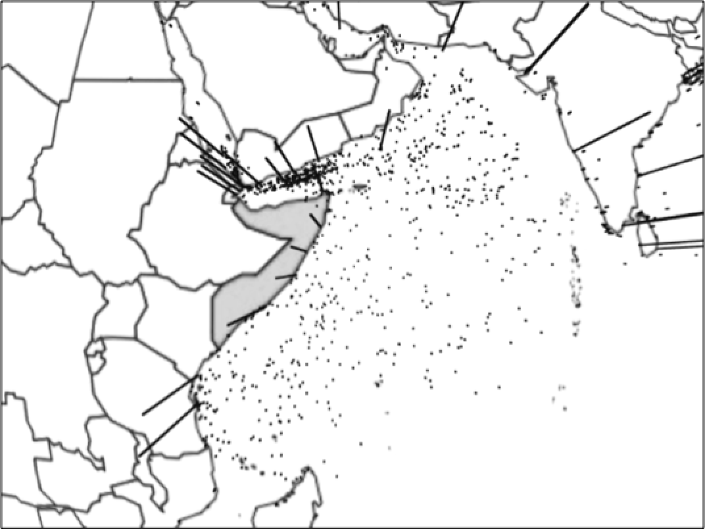

# Introduction


With a fleet of around 3,500 of the world’s largest merchant vessels, Germany has a strong motivation to ensure the security of global sea routes, with an average of EUR 47.4 million lost to trading disruption annually, and 1,400 service-men and women actively engaged in counter-piracy measures today. 

Increasingly, German foreign policy maritime piracy has paid special attention toward the Horn of Africa. ATALANTA, the European Union's naval mission to this area, currently patrols along the coast of Somalia to defend trading vessels from maritime piracy attacks. As it seems, fading media attention does not presuppose a reduced danger of maritime piracy globally.

Global shipping routes are highly important for trade. Piracy attacks are a potential threat for crew and cargo on the ship. The cost intensive deployment of international naval forces in Somalia shows how serious countries take the threat whose trade is affected. Interestingly not all piracy attacks are successful, and the ratio varies from country to country and over time. So what drives piracy attacks, why and when are they successful?
Research Design

# Research Design

This paper seeks to conduct research and propose several testable hypotheses that can be modeled to explain key trends, insights and patterns in global piracy levels, and identify circumstances in which attacks are successful.

Pursuant to this, our paper is structured with three key focuses:
1. Global and regional overview: coastal length & vessel status determinants
2. Country-piracy rankings and the effect of military expenditure
3. Success ratios determinants for piracy attacks 

Dividing our research into three distinct sections should aid this paper in trying to

Does the number of attacks decrease the likelihood of attacks being successful?

The dependent variable is the success rate of piracy attacks, calculated by the number of successful attacks divided by the total number of attacks. We expect that mainly the total number of attacks has an impact on this ratio. The fact that the dependent variable actually consists of our key independent variable is dangerous. However, we think that there must be a visible learning effect, either from law enforcement bodies, the shipping crew, or the pirates. So far this was the only feasible way we could have a look at this effect.

Furthermore, additional exogenous variables will be included that in theory should have an impact on the inspected success rate. GDP (per capita per year) as a mirror for the economic incentives to conduct piracy is expected to influence the success rate over time. Likewise, a country's ratio of coast line to its land area should be a good demarker, whether piracy attacks happen more often.

1.	After a certain amount of piracy attacks, the success rate has a peek and will decrease.
2.	The higher the GDP, the less incentive there is to conduct an attack and only less skilled pirates will make attempts, hence the success rate decreases.
3.	The higher the coast-land ratio is, the more people decide to conduct attacks and skilled pirates emerge, hence the success rate increases.

# Data & Definition of Piracy 

To commence our understanding for piracy under the United Nations Convention on the Law of the Sea, we define a piracy attack for the purpose of our study under Article 101:

Article 101 Definition of piracy Piracy consists of any of the following acts: 
(a) any illegal acts of violence or detention, or any act of depredation, committed for private ends by the crew or the passengers of a private ship or a private aircraft, and directed: (i) on the high seas, against another ship or aircraft, or against persons or property on board such ship or aircraft; (ii) against a ship, aircraft, persons or property in a place outside the jurisdiction of any State; 
(b) any act of voluntary participation in the operation of a ship or of an aircraft with knowledge of facts making it a pirate ship or aircraft; 
(c) any act of inciting or of intentionally facilitating an act described in subparagraph (a) or (b). 

The International Maritime Bureau (IMB) collects since 1992 all reported piracy attack globally. Since then it publishes annually an overview of all attacks that happened in a year. These annual reports provided by the IMB contain detailed information about every incident, which allows for further analysis of distinct types of piracy attacks, for instance successful attacks v. attempted attacks.

The annual reports were scraped with text analysis tools. Our team received a "ready to use" dataset from a research project from the university of Tennessee, including all global piracy attacks from 1994 to 2014.

## Additional Data Gathering: World Bank & Wikipedia Country Coast-Area Ratios

The original dataset contains the attacks that were reported by the victims of piracy. As an additional variable, relevant to our field of piracy investigation and patrols, we were intrigued by the relative effect that a longer coast length of a country has on the level of attacks that country suffers. To address this question we parsed a table titled "List of countries by length of coastline" from a Wikipedia page that had, in turn, used information from the CIA World Factbook. We then merged this coastline data with our existing dataframe using a 'right outer join'.

Of critical interest to us were the respective 'Coast/Area' ratios (measured in km of coast length to km of square land) that serves as an insightful control for our country dependent variable.

The information about the gross domestic product comes from the Worldbank and was scraped with the WDI package for R. The scraped data comes in a country-year format, thus it comes already in a format we need to conduct our analysis.


# Global and Regional Overview: Coastal Length & Vessel Status Determinants

Our global overview model provides insight on the issue of piracy 'on the high seas', by investigating whether a country's coastal length has an effect on the number and location of pirate attacks we can observe. The assumption here is that if a country has a higher coastal to country ratio (an island-state, such as Malta in figure 2, for instance) then it should be less likely that that country is affected by maritime piracy, since there is a greater incentive to defend itself and maritime defence is therefore prioritised and greater in that country.

* H1: Most pirate attacks occur in areas where countries have smaller country-to-coast ratios, and thus are less incentivised to defend against maritime pirate attacks. 
* H0: Whether a country has a greater country-to-coast ratio has either an inverse or no effect on where pirate attacks occur.

To observe this we have coded the arc length (shown in black) of the individual attacks that occur to show height of coastline-to-country ratios. If there is a tall arc, then the country has a proportionately higher coastal size. The expectation is therefore that fewer tall arcs should appear since these countries are actively patrolling and bordering their vulnerable coastlines.

 


Nb. Arc length indicates high coast length to country mass

This is not always the case, depending on region. Our H1 remains true for the area around the Gulf of Aden and particularly in the Arabian Sea, where countries with less incentive to defend maritime areas do indeed suffer from higher attack frequency. Oman, Pakistan, India, Somalia, Kenya and Tanzania are prime examples of this pattern.

However, the results change when shifting focus to the South China Sea. Despite Indonesia and the Philippines (highlighted in figure 1) having very long coastal lengths, a lot of attacks can be observed. This confirms our H0 null hypothesis, with contrary results occuring for Southeast Asian States.


 


<div>
 

* H1: Stationary ships are more likely to be attacked than moving ships in Southeast Asia. 
* H0: Stationary ships are no less, or less likely, to be attacked than moving ships in Southeast Asia.

In this globe we take a regional focus for Southeast Asia. We can observe that whether a ship was moving (dot) or stationary (arc) appears to make little difference to the number of relative pirate attacks. This could be potentially due to the archipelago maritime geography; with many ports concentrated in a small area pirates may have similar accessibility to pirating trade both for anchored ships as well as for ships underway.
</div>


 

Nb. Arc length indicates vessel status (moving to stationary)

* H1: Stationary ships are more likely to be attacked than moving ships in the Arabian Sea. 
* H0: Stationary ships are no less, or less likely, to be attacked than moving ships in the Arabian Sea.

In this globe we take a regional focus for the Arabian Sea that includes the Gulf of Aden. We can observe that whether a ship was moving (dot) or stationary (arc) appears to make a large difference to the number of relative pirate attacks. Ships that were underway were more likely to be attacked. This is likely due to how large oceangoing ship traffic often transits through the Arabian Sea, but does not anchor. Pirates are therefore forced to conduct mobile pirate raids.

# The Effect of Military Expenditure and of Armed Conflict on Piracy

In order to approach the question about what drives piracy, we decided to take a multi pronged approach.  While the analysis that preceded this segment of the report focused on incident level data and visualizing it in a novel way for analytical purposes, this portion of our research focuses on aggregated yearly data for the eight countries that were the closest coastal state to the most frequent occurrences of piracy.  These countries are predominantly in South East Asia, but there are a few exemptions.  The countries are: Bangladesh, Brazil, India, Indonesia, Malaysia, Nigeria, the Philippines, and Vietnam.  

While it is important to note that we could be skewing our data by both selecting for countries that are home to the most frequent occurrences of piracy as well as by aggregating our data to the year level.  However, by doing we also enable several advantages.  By aggregating the data, we are able to explore the information in a different way than either of the other two sections in this research paper.   Both of the other threads of research deal with incident level data which is useful, but here we can explore questions such as: what drives the number of attacks per year, does military expenditure play a role, are there any identifiable trends among the most heavily pirated countries? 

We begin our aggregated data level analysis with a simple histogram showing the frequency of attacks sorted by the attacks per year in bins of 20. It quickly becomes evident, that the vast majority of years had 1-20 reported attacks. The frequency then declines sharply within the 20-40 range and then again in the 40-60 range. We see a slight surge in number of attacks per year within the 80-100 range; this is due to highly pirated coastal areas such as Bangladesh and the Philippines.

```{r, echo=FALSE, message=FALSE}
library(base)
library(rio) # swiss army knife for imports
library(plyr) # count occurences
library(dplyr) # data wrangling
library(tidyr) # data wrangling
library(ggplot2) # nice plots
library(stargazer) # nicer regression output which looks like a real publication
library(car) # scatterplots 
library(httr) # scraping from http sites
library(XML) # Tool for generating XML file
library(WDI) # Scraping Data from the World Bank 
library(countrycode) # provides world bank country codes 
library(gplots)
library(plm)
library(knitr)
library(stargazer)
#import data
# empty cells are now coded with NA and can manually be excluded from any function with na.omit command
shipping <- read.csv("shippingraw.csv", header = TRUE, sep = ",", stringsAsFactors = FALSE, na.strings = c("", "NA"))

#renaming and dropping some of our columns 
names(shipping)[1] <- 'country'
names(shipping)[2] <- 'year'
shipping$X1 = NULL
names(shipping)[3] <- 'coast/Area ratio (m/km2)'
names(shipping)[4] <- 'GDP per cap'
names(shipping)[5] <- 'attacks/Year'
names(shipping)[6] <- 'successful Attacks/Year'
names(shipping)[7] <- 'success Ratio'
```
```{r, echo=FALSE, fig.cap="Frequency of Attacks per Year in Bins"}
hist(shipping$`attacks/Year`, main='Frequency of Attacks per Year in Bins', xlab='Number of Attacks per Year', ylab='Frequency')
```


When we examine the heterogeneity of attack success across countries it appears that a pirate's chance of a successful attack is highly dependent on the closest coastal state. For instance, the chances of a successful attack in the Philippines is lower than the odds of a successful attack in Bangladesh or Brazil. This also holds true when considering confidence intervals which are also depicted.
```{r, echo=FALSE, fig.cap="Average Success Ratio of Pirates per Country"}
plotmeans(shipping$`success Ratio` ~ country, main="Average Success Ratio of Pirates per Country", data=shipping, xlab="Country", ylab="Success Ratio")
```
The variable success rate was created by taking the number of successful attacks and dividing it by the number of attempted attacks. Thus, we can conclude that every pirate attack in India has a mean chance of 80% of success, with fairly large 95% confidence intervals stretching out from 85% to 75%, approximately. 


When we examine the heterogeneity across years the means seem to stay within the .65 - .85 range. Thus, we can conclude that the average chance of a pirate attack succeeding is between 65% and 85%.  This of course depends on many variables such as year, country, and as well explore later, the military expenditure of those countries.  Due to extremely large confidence intervals, time does not appear to be statistically significant.

```{r, echo=FALSE, fig.cap="Average Success Ratio of Pirates per Year"}
plotmeans(shipping$`success Ratio` ~ year, main="Average Success Ratio of Pirates per Year", data=shipping, xlab="Year", ylab="Success Ratio")
```

Through various models, it became evident that this portion of our research, which was based off of aggregated yearly data, was much more apt at explaining the number of attacks per year instead of the success ratio of attacks.  This can be easily understood by a brief glance at our list of variables.  On the incident level we have indicators such as vessel type and vessel status, e.g., what kind of ship is it and what is it doing - moving or sitting still.  These factors play a much more significant role in predicting whether or not pirates will be successful. However, this current portion of the research allows us to include factors that our other models cannot such as GDP per capita in the closest coastal country, military expenditures, etc.   All of these factors are more strongly related to attack frequency, as we will show.

Military expenditure proved to be a much stronger explanatory variable for predicting attacks per year than another variable which we attempted to add to our model, 'Intensity Level' which measures armed conflict in the area. 

```{r, echo=FALSE, message=FALSE}
#import data
# empty cells are now coded with NA and can manually be excluded from any function with na.omit command
ucdp.prio <- read.csv("124920_1ucdpprio-armed-conflict-dataset_v.4-2015.csv", header = TRUE, sep = ",", stringsAsFactors = FALSE, na.strings = c("", "NA"))
# have a look at how the variables are created

names(ucdp.prio)[3] <- 'country'
names(ucdp.prio)[2] <- 'year'

ucdp.prio$ConflictId <- NULL
ucdp.prio$SideA <- NULL
ucdp.prio$SideA2nd <- NULL
ucdp.prio$SideB <- NULL
ucdp.prio$SideBID <- NULL
ucdp.prio$SideB2nd <- NULL
ucdp.prio$Incompatibility <- NULL
ucdp.prio$TerritoryName <- NULL
ucdp.prio$CumulativeIntensity <- NULL
ucdp.prio$TypeOfConflict <- NULL
ucdp.prio$StartDate <- NULL
ucdp.prio$StartPrec <- NULL
ucdp.prio$StartDate2 <- NULL
ucdp.prio$StartPrec2 <- NULL
ucdp.prio$EpEnd <- NULL
ucdp.prio$EpEndDate <- NULL
ucdp.prio$EpEndPrec <- NULL
ucdp.prio$GWNoA <- NULL
ucdp.prio$GWNoA2nd <- NULL
ucdp.prio$GWNoB <- NULL
ucdp.prio$GWNoB2nd <- NULL
ucdp.prio$GWNoLoc <- NULL
ucdp.prio$Region <- NULL
ucdp.prio$Version <- NULL

ucdp.prio <- ddply(ucdp.prio, .(country, year), numcolwise(sum))

ship.ucdp <- merge(shipping, ucdp.prio, by=c("country","year"), all.x=TRUE) 
remove(list=c("shipping"))
remove(list=c("ucdp.prio"))

ship.ucdp <- unique(ship.ucdp[ , 1:8 ] )

ship.ucdp$IntensityLevel[is.na(ship.ucdp$IntensityLevel)] <- 0 

#######################
#adding military expenditure numbers
######################
#import data
# empty cells are now coded with NA and can manually be excluded from any function with na.omit command
Military <- read.csv("Military.csv", header = TRUE, sep = ",", stringsAsFactors = FALSE, na.strings = c("", "NA"))
# have a look at how the variables are created

names(Military)[1] <- 'country'
names(Military)[2] <- '1992'
names(Military)[3] <- '1993'
names(Military)[4] <- '1994'
names(Military)[5] <- '1995'
names(Military)[6] <- '1996'
names(Military)[7] <- '1997'
names(Military)[8] <- '1998'
names(Military)[9] <- '1999'
names(Military)[10] <- '2000'
names(Military)[11] <- '2001'
names(Military)[12] <- '2002'
names(Military)[13] <- '2003'
names(Military)[14] <- '2004'
names(Military)[15] <- '2005'
names(Military)[16] <- '2006'
names(Military)[17] <- '2007'
names(Military)[18] <- '2008'
names(Military)[19] <- '2009'
names(Military)[20] <- '2010'
names(Military)[21] <- '2011'
names(Military)[22] <- '2012'
names(Military)[23] <- '2013'
names(Military)[24] <- '2014'


library(reshape)
x2 <- melt(Military,id=c("country"),variable_name="Year")
x2[,"Year"] <- as.numeric(gsub("X","",x2[,"Year"]))

names(x2)[2] <- 'year'
names(x2)[3] <- 'Military Expenditure'

ship.ucdp.mil <- merge(ship.ucdp, x2, by=c("country","year"), all.x=TRUE) 
remove(list=c("Military"))
remove(list=c("x2"))
remove(list=c("ship.ucdp"))
```
```{r, echo=FALSE, fig.cap="Visualizing the Affect of Military Expenditure on Piracy Rates"}
plot(ship.ucdp.mil$`Military Expenditure`, ship.ucdp.mil$`attacks/Year`, main='Visualizing the affect of Military Expenditure on Piracy Rates', xlab='Military Expenditures', ylab='Number of Attacks per Year')
```


Unfortunately, including both an indicator for armed conflict in the closest coastal state as well as an indicator for military expenditure in the closest coastal states would prove to yield biased results due to multicollinarity.  As we can visually see, both potential indicators are correlated with each other.

```{r, echo=FALSE, fig.cap="Visualizing the Correlation Between Armed Conflict and Military Expenditures"}
plot(ship.ucdp.mil$IntensityLevel, ship.ucdp.mil$`Military Expenditure`, main='Visualizing the Correlation Between Armed Conflict and Military Expenditures', xlab='Conflict Intensity', ylab='Military Expenditures')
```

This finding is actually quite intuitive as states that have armed conflict are likely to increase their military expenditure.  

Below is a table of both our OLS regressions and Fixed Effects Regressions. Although OLS regression does not consider heterogeneity across groups or time, an OLS regression can still prove useful for gathering initial insight into the relationship of our variables.

Our analysis does show that when running an OLS regression, military expenditure indeed has a statistically significant relationship with the frequency of attacks with a negative coefficient of -15.32 at a P value lower than .01%.  Additionally, this statistically significant relationship and negative coefficient remain essentially constant as we add control variables such as coast ratio and GDP per capita.  Our model consistently explains 14-15% of the variation in attacks per year as indicated by our R2.  This confirms our earlier plot graph's visual results.  Interestingly, neither GDP per capita nor coastline ratio proved to be statically significant in this model for explaining the frequency of piracy attacks.  

Unfortunately when we ran a Fixed Effects regression on the data, military expenditure was no longer statistically significant when ran by itself.  Interestingly, military expenditure does become significant (at the .1 level) once GDP per capita has been added. Again the coefficient yielding is negative and are similar to the OLS results.

```{r, echo=FALSE, message=FALSE}
ols1 <-lm(ship.ucdp.mil$`attacks/Year` ~ ship.ucdp.mil$IntensityLevel, data=ship.ucdp.mil)

ols2 <-lm(ship.ucdp.mil$`attacks/Year` ~ ship.ucdp.mil$`Military Expenditure`, data=ship.ucdp.mil)

ols3 <-lm(ship.ucdp.mil$`attacks/Year` ~ship.ucdp.mil$`Military Expenditure` + ship.ucdp.mil$`coast/Area ratio (m/km2)`, data=ship.ucdp.mil)

ols4 <-lm(ship.ucdp.mil$`attacks/Year` ~ ship.ucdp.mil$`Military Expenditure` + ship.ucdp.mil$`coast/Area ratio (m/km2)` + ship.ucdp.mil$`GDP per cap`, data=ship.ucdp.mil)

fixed1 <- plm(ship.ucdp.mil$`attacks/Year` ~ ship.ucdp.mil$`Military Expenditure`, data=ship.ucdp.mil, index=c("country", "year"), model="within")

fixed2 <- plm(ship.ucdp.mil$`attacks/Year` ~ ship.ucdp.mil$`Military Expenditure` + ship.ucdp.mil$`GDP per cap`, data=ship.ucdp.mil, index=c("country", "year"), model="within")
```

Stargazer


# Micro Level: Determinants for successful piracy attacks

```{r, echo=FALSE, message=FALSE}
# Call libraries we need for the project, make sure you have them installed
library(base)
library(rio) # swiss army knife for imports
library(plyr) # count occurences
library(dplyr) # data wrangling
library(tidyr) # data wrangling
library(ggplot2) # nice plots
library(stargazer) # nicer regression output which looks like a real publication
library(car) # scatterplots 
library(httr) # scraping from http sites
library(XML) # Tool for generating XML file
library(WDI) # Scraping Data from the World Bank 
library(countrycode) # provides world bank country codes 
library(gplots)
library(plm)
library(knitr)
library(Hmisc) # variable labels
library(Amelia) # map missing values 
micro <- read.csv("MaritimePiracyTennessee.csv", header = TRUE, sep = ";", stringsAsFactors = FALSE, na.strings = c("", "NA"))
sub <- micro[c(4, 6, 12, 18, 24, 23)]
######
#DATA WRANGLING
######

#renaming and recoding
names(sub)[1] <- 'year'

names(sub)[2] <- 'time'
sub$time <- factor(sub$time,
                    levels = c(1,2,3,4),
                    labels = c("early", "day", "evening", "night"))
sub$time <- factor(sub$time)

names(sub)[3] <- 'state'

names(sub)[4] <- 'type'
sub$type[sub$type==1] <- 111
sub$type[sub$type==5] <- 111
sub$type[sub$type==9] <- 111
sub$type[sub$type==2] <- 222
sub$type[sub$type==3] <- 222
sub$type[sub$type==4] <- 222
sub$type[sub$type==6] <- 222
sub$type[sub$type==7] <- 222
sub$type[sub$type==8] <- 222
sub$type[sub$type==111] <- 1
sub$type[sub$type==222] <- 2
sub$type[sub$type==-99] <- NA
sub$type[sub$type==10] <- NA
sub$type[sub$type==22] <- NA
sub$type[sub$type==696] <- NA
sub$type <- factor(sub$type,
                   levels = c(1,2),
                   labels = c("small", "big"))
sub$type <- factor(sub$type)

names(sub)[5] <- 'incident'
sub$incident[sub$incident==-99] <- NA
sub$incident <- factor(sub$incident,
                   levels = c(0,1),
                   labels = c("attempted", "acutal"))
sub$incident <- factor(sub$incident)

names(sub)[6] <- 'stat'
sub$stat[sub$stat==-99] <- NA
sub$stat <- factor(sub$stat,
                    levels = c(1,2,3,4))
sub$status <- recode(sub$stat, "c(1)='2'; c(2,3,4)='1'") # what a bastard this line was arrgg
sub$status <- factor(sub$status,
                   levels = c(1,2),
                   labels = c("stationary", "moving"))
sub$status <- factor(sub$status)
sub$stat = NULL
```

Digging deeper into the field of maritime piracy studies reveals that patterns of maritime piracy changed over time and per region. Among the many incidents in global hotspots for piracy, not all incidents are successful. But why are some pirates more successful than others? Whilst we understand that the danger of an attack differs depending on some few characteristics, it is possible to change behaviour and protect the crew and the cargo. The idea for this research paper is, thus, to identify under which circumstances an attack is successful. What has determined the success rate of maritime piracy attacks during 1995 and 2014?

```{r, echo=FALSE, fig.cap="Frequency of attempted and successful attacks", fig.height=2, fig.width=2}
# barplot for frequency of attacks
a <- ggplot(data=na.omit(sub), aes(x=incident))
a + geom_bar(stat="bin") +
  xlab("Incidents") +
  ylab("Frequency") +
  ggtitle("Frequency of Attacks")
```


In theory there are many possible factors that influence the process of a piracy attack at sea. I expect that, among others, the risk of an attack being successful changes with the ship type, the time of day and whether a ship is in motion or not. For these predictors I would like to make the following hypotheses:

* H1. The success rate of an attacks shrinks for big ships,
* H2. And for vessels in motion, 
* H3. And during the day.

## Micro Level: Data Description

In this section we try to make sense of the data, and explain in which format it will be used for the analysis.

The original data comes from the International Maritime Bureau, or IMB. Since 1991 they gather global piracy incidents in a standardized format and publish some statistics and their raw data in an annual report. A research team around Professor Christian Traxler from the Hertie School of Governance parsed the data out of the annual reports in PDF format, and merged them into one dataset about piracy attacks from 1993 to 2011 (counts 5619 attacks). As a courtesy from Professor Ursula Daxecker from the University of Amsterdam, I received a ready-to-use dataset, which as a subset of the original data contains slightly differently coded and less variables for the analysis from 1993 to 2014 (counts 6.343 attacks). 

The unit of analysis in all datasets is the single attack, or in other words one row equals one attack. As my analysis builds up on the dataset from Professor Daxecker, in the following I will refer to her version of the dataset solely. The dataset comes already slightly reduced. It contains 25 variables, and counts 6.343 attacks in between 1993 and 2014. I kept the wide format of the dataset, but reduced it to the variables of interest. In more concrete terms, you will find a binary coded dependent variable for the incident type, or whether an attack was successful or not. The explanatory variables are the ship type, adjusted depending on the model, the ship's status, or if it is moving or not and a time of day variable splitting one day into 4 time categories. Still, the necessary variables needed some wrangling. I cleaned them from missing and nonsensical values, renamed the variable and value labels, and grouped some categories of the key categorical variables.


